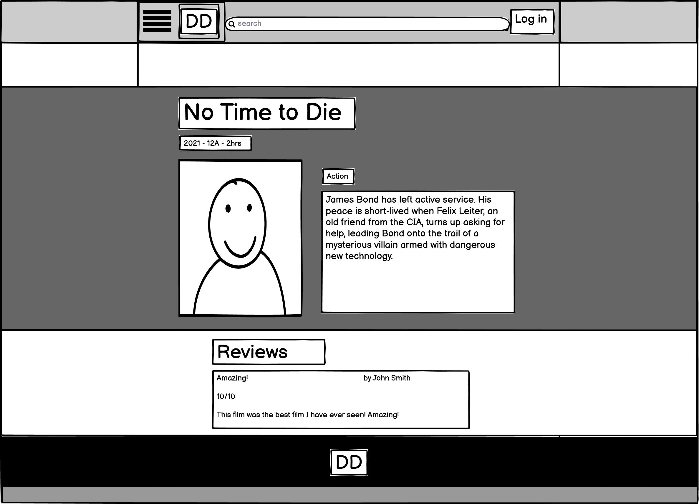
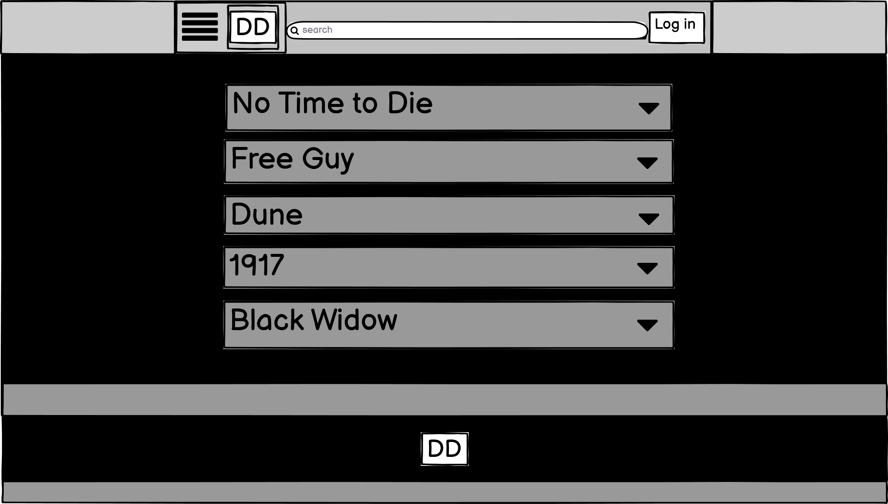

# DIRECTOR DAD

Welcome to my Backend Development Milestone Project.

In this project I will be creating a fully functioning website, both frontend and backend. This website was inspired by my Dad who in the years from 2019 - 2021 (since retiring) purchased himself an unlimited cinema card and started reviewing all the films he went to see with a score out of 10. I was also inspired by the wonderful IMDB which is a wonderfully designed, gigantic library of films and TV shows.

I decided to created a website where users can sign up, log in, and place their own reviews of films that they have seen either at the cinema or on TV. Users can create their own reviews of existing films, or add their own films that they have seen, submit a review of that film and in doing so allow others to also review that film.

## Table Of Contents

1. [**UX**](#ux)
    - [**Project Goals**](#project-goals)
    - [**User goals**](#user-goals)
    - [**Developer Goals**](#developer-goals)
    - [**User Stories**](#user-stories)
    - [**Design choices**](#design-choices)
    - [**Wireframes**](#wireframes)

2. [**Features**](#Features)
    - [**Main Features**](#main-features)
    - [**Technologies Used**](#technologies-used)
    - [**Testing**](#testing)

3. [**Deployments**](#deployments)

4. [**Credits**](#credits)

5. [**Content**](#content)

6. [**Media**](#media)

7. [**Acknowledgements**](#acknowledgements)

# UX

## Project Goals

The primary goal of Director Dad was to put the reviews that my Dad had made into one place that other users can visit and potentially become interested in seeing those films, as well as a place where users can submit their own reviews of films and new films that my Dad (or "the developer") have not seen, a place to share opinions with each other, which films you MUST see and which to avoid!

#### User Goals

* A place to find out which films to watch and which to avoid.
* A place where users can submit their own reviews and add their own films to the library.
* A simple, intuitive creation system that easily allows users to create, view, edit and delete their reviews/films.
* Simple, smart colour scheme with obvious breaks between content and buttons for going forward and backwards.
* Fun design with creative icons for each input.
* Pictures of films, with their movie posters for visual users to see which films might be good/bad.

#### Developer Goals

* "Hopefully", an ever expanding library of films / TV shows, for all users to come and go, reviewing or finding reviews of current or old films that they are looking to watch or maybe have never heard of.
* A place where the developer or "Director Dad" to find out about other users highly rated films and to share with others their opinions of the films they have seen.

## User Stories

#### As a User, I want:

1. An easy to use library of films that, if I want to just look through films and reviews of films I can do that, but equally if I want to share my opinions, I can easily leave reviews/ add new films to the library too.
2. A website that is easy to move between films & simple to submit or read other reviews.
3. The ability to Create, Read, Update & Delete both reviews and films.
4. A website that users will keep coming back to every time they watch a new film or are looking for something new to watch.

#### As a Developer, I want:

1. A place that I can share my opinions/reviews of films I have seen.
2. A website that is easy to use for myself, where I can submit a new review in under 30s, update old reviews or delete them if I change my mind.
3. The ability to add new films, remove films if I choose to or update them with new pictures or information.
4. As an "Admin" - to be able to add new genres of films where necessary or to remove other peoples films submissions or reviews that I may deem unhelpful or inappropriate.

## Design Choices

This website was styled of off the famour IMDB with their white, grey and black colour scheme with yellow buttons and highlights. I did my best to recreate the website styling as much as possible!

#### Fonts

* No fonts were imported from google fonts, only the default font that is used with materialize. I mainly customised the sizing and weight of the fonts to allow different elements to stand out.

#### Icons

* The Icons I used were taken from font-awesome. I mainly used them for drop-down icons and for the submission forms for films, genres and reviews.

#### Colours 

* As stated above the colour scheme was inspired by IMDB with the monochromatic base plate and a small amount of yellow for highlighting and red for cancel/delete elements. 

#### Styling

* Simple panels for each section of the page. For example on the "view_films" pages, I had the black/grey navbar, a black space below, the grey panel for the movie information, a white panel for the reviews section, a similar end black panel to close off the reviews section then a black and grey footer to close it off. 

#### Background, Images & Audio

* The background was black, similar to the inspired website with the front elements either grey or white to stand out. All images were sources from IMDBs movie posters. No audio was used.

## Wireframes

My wireframes were created using [Balsamiq](https://balsamiq.com/).

As i knew that I wanted my website to look as similar to IMDB as possible my wireframes were based off of one of their generic film pages. Due to my ability limitations I was unable to get videos or as many images, ads, links, interviews and the large amount of media they have associated to each film, so it ended up being a much simpler version in the end.



As stated above, IMDB has so much media associated with each film, the trailers, interviews, screenshots, premier shots, that I am unable to feesible include in my own version. Therefore the final product is alot simpler than that of IMDB.

The films page is quite similar as it was based off of the "task manger" mini project I created before starting my final project.



# Features 

## Main Features

* Film Library (HOME) - The landing page, why everyone is here, the (soon to be) HUGE library of films! Where users can scroll through the films that "Director Dad" has reviewed, and read the reviews for each of them!

* Nav Bar / Side Bar - I chose to have a minimalistic top nav bar and have most of my navigation in the side bar. This created (in my opinion) a much cleaner looking website when the user is not navigating, as well as a more styling side bar when users are looking to move around the website.

* Search Bar - Using Materializes' autocomplete navbar I was able to create a search bar where users can simply search for one of the films already in the database (added by admin) and by clicking on that film, the user will jump straight to that films unique page.

* Film Pages - Each film in the library can be clicked on which takes you to that films page. Here users can again read up about the films, the age rating, how long it is as well as any associated reviews.

* Login / Register - If users wish to leave reviews or add new films to the library then they need to sign up! All they need is a username and password and they are part of the community, ready to review away.

* New Film / New Review - Registered users can navigate to the side bar and add a new film or review. They just need to film out the form, with information about the film or about their experience with the film. They will also need to fill out all sections of each form as they are all "required".

* Genres / New Genre (ADMIN) - When logged in as the Admin (Director Dad) you can view the genres already added to the website that users can select from when adding new films. The admin has the *power* to add / delete genres as well as all submitted films and reviews by any other user.


# Technologies Used

* HTML 
* CSS
* JS
* PYTHON / FLASK
* MONGO DB - to store my data in databases to be edited / created by users on the website.
* HEROKU - to deploy my final website to.
* [Materialize](https://materializecss.com)
    - Materialize was amazing in creating this project. Their pre-made layouts, css, js initialisation and overall framwork, made customising this website alot of fun.
* [Font Awesome](https://fontawesome.com/)
    - FA used to implement all the icons for improving UX and the website design.
* [Code Institute](https://codeinstitute.net/)
    - Many of the code techniques and lines of code from previous projects created were re-used in this project. Such as how to create functions, for & if loops, linking each page together with url_for()'s and setting up the base plate of the website with importing the correct frameworks. 

# Testing

## Testing the stories from UX section

### As a User, I want:

1. An easy to use library of films that, if I want to just look through films and reviews of films I can do that, but equally if I want to share my opinions, I can easily leave reviews/ add new films to the library too.

* A simple, yet intuitive website that allows users to browse films and other reviews without signing up or logging in. They can however also choose to sign-up and leave their own reviews or add new films. But they don't have to.

2. A website that is easy to move between films & simple to submit or read other reviews.

* With the click of a button or the search of a name, users can be immediately at the film of their choice, reading reviews, or adding their own.

3. The ability to Create, Read, Update & Delete both reviews and films.

* Users, once logged in, can navigate to the side bar where they can submit a new film / review. Once submitted the film / review will be associated to them so can be updated or deleted by themselves only. (or the Admin)

4. A website that users will keep coming back to every time they watch a new film or are looking for something new to watch.

* As the website is so quick and easy to use, users will find it very simple and satisfying to come back and quickly place their next review, or to find their next film to watch.


### As a Developer, I want:

1. A place that I can share my opinions/reviews of films I have seen.

* Even a developer should get to spend some time relaxing, watching a movie. Here the developer can watch their library expand with other users reviews and film submissions, so that they themselves can find something new to watch.

2. A website that is easy to use for myself, where I can submit a new review in under 30s, update old reviews or delete them if I change my mind.

* Submitting a new review or adding a new film takes no time at all. All the developer has to do is select the form from the side nav bar and then fill in the details on the form and press submit.
The developer can also simply search for the film or click on the film to be taken to the films page where they can read, update or delete their own reviews or other peoples.

3. The ability to add new films, remove films if I choose to or update them with new pictures or information.

* As stated above as the admin of the website the developer has full access to all films and reviews. They can add new ones, or update / amend the old ones.

4. As an "Admin" - to be able to add new genres of films where necessary or to remove other peoples films submissions or reviews that I may deem unhelpful or inappropriate.

* If the developer wishes to add a new film that doesn't really fit any of the current genres then they can add a new one quickly by clicking add new genre. They also have access to update or delete other users submissions.


### ON THE GO TESTING / PROBLEMS

1. HTML/CSS 
    - It had been a little while since I had customised my own CSS. The main difficulties I found was trying to customised the already heavily customised materialize content. Changing the colours or finding out which customisation was stored where via materialize took up a large portion of my "css'ing". A large majority of the css in my style.css file is css used to counter-act the css created by materialize.
    - However using the materialize grid and container system really did help the website come to life in no time at all. I also really enjoyed using some of their features that I had never used before such as datepicker as well as the usual forms, select, navbar & sidenav elements.

2. COLOUR SCHEME
    - Similarly to the css issues I had from materializes' defaults, I struggled sometimes to see which element and at which state the colours were being applied. Still to this moment I am unsure the best way to completely change the colours of their custom elements.

3. NAVBAR / SIDEBAR
    - As I was basing the nav bar / side bar styling off IMDB, it took my a while to be happy with the centralised layout of the navbar, battling with containers and padding in order to get it how I liked. I ended up opting for most of my links in the sidebar to give the top navbar a cleaner look.

4. SEARCH BAR 
    - I decided to use an autocomplete navbar from Materialize instead of the search function from the mini-project. I always use autocomplete search functions in my day-to-day life, so wanted to try one of my own. At first I was unsure how to add each piece of data into the search script but after following the materialize documentation, I worked out how to add each film to the search function using the data object options.

5. FILM PAGES
    - I wanted each film to have its own page that would hold the reviews and potentially (eventually) more images or more information about that film. It didn't take me long for me to work out how to re-use the same function that I used to edit my films & reviews, by brining up a new page specific film, to instead bring up this page.

6. FILM IMAGES 
    - I ideally wanted to bring some life and colour to my project in the form of movie posters (credit to IMDB). I started out by manually adding each of them. Once I (a user) had added a new film, I would manually add the film_image id into mongodb to make the film image appear on the page. I had already created a space for the image to be, but if a user other than myself was to create a film, they would not have access to mongodb so the film would never get an image. I was unhappy with this and wanted the users to be able to upload their own image. I therefore added a new form input where users could supply a URL link to the film image. This, didn't work at first, the id came up as null. This stumped my unfortunately and I had to take it to slack. Another member of the community pointed out that I had my input type as text where it should be url. I'm sure that this did help but it still didn't work at this point. Foolishly I realised that I had the wrong name, id and label id of image... when it should have been film_image, to match my mongodb id name. When meticulously checking over every detail I noticed that my mongodb id name was different and problem solved.
    Applying this same image to the main films page on medium size screens and above was simple. Just copy the same code across from the view pages and adjust the size of the film!

7. ADMIN CONTROL
    - I wanted the admin to be able to have control over other peoples reviews and film submissions. Therefore I tweaked the code from  to  to allow not only the specific user to be able to edit their entried but the admin to have full control over the website.

8. FILM SPECIFIC REVIEWS
    - When I first added the reviews to the view_films pages, every review was showing on every film page. This was because I used the same function that was showing every film on the film page, a simple. I couldn't work out how to show only the reviews specific to that film. I made use of Code Institutes Tutor Support to push me in the right direction. He suggested to and an if loop to my for loop to loop through whether or not the film_name == review.film_name. Simple stuff when you think about it. The final code I came up with was . This used both a for loop and if loop in one. It turned out perfect!

9. COLLECTION ORDERS
    - For some reason I decided to add the film ratings (out of 10), my dates (2019, 2020 & 2021) and my age ratings (U, PG, 12A etc) as collections (instead of just manually having the options on the necessary forms). The caused issues as the materialize select options were automatically sorting them, or maybe it was my .sort() function in python... Either way, I wanted them sorted the way I had created them not in alphabetical order. This turned out to be a very simple fix that I coincidentally worked out whilst the tutor was trying to work it out himself. (this seemed to happen alot - Rubber Ducky Theory?) It was simple as adding an "s". Turns out I was targeting the individual ratings not the collection as a whole.

10. MEDIA QUERIES
    - A struggle with every project, making sure it works on mobile devices as well as desktop. Most of the media queries were created early on when creating the navbar and sign-up forms. I had to make sure that my navbar elements were not overlapping and looking to cluttered on the small size screens and phones. I chose to remove the search function and main page images on smaller screens. This caused a lot of clutter and push the text and title too far down the screen potentially causing a bad ux.


### POST-CONTRUCTION TESTING

* Once I felt I had completed this project, I took the project to the browser to complete some further testing and complete the lighthouse testing.

1. For the Lighthouse testing, all of my pages came out with scores of 90+. I added a meta-description which I had forgotten and checked that all my colours worked well and that my page was loading well and that all my links were appropriate for screen readers.

2. For the Website testing, I made myself a new account and acted like a new user. I signed up, logged in and started "browsing" the website. I added a new review to "Free Guy" which was simple without any problems, then saw it appear below the film on that specific page. There were the options to edit or delete this review but not for the others. It all worked as expected. On the side menu I was unable to see the genres page (as this is for admin only) and could not see any buttons to edit/delete the films.

3. Just before submitting my project I took a visit to see my family. I asked them all to create a profile on my website and try to explore it and leave some reviews. It was drawn to my attention that when on a films page, there was no direct button/link to leave a review and users would instead have to use the link on the side navbar. I of course therefore added a link onto the view_films pages to make it more intuative.

4. I also found out that the autocomplete links were not working since deploying my project to Heroku. I had to therefore manually change all links to the Heroku versions instead of github.

# Deployments

## Heroku

This project was deployed to Heroku through the following steps:

1. Create a "requirements.txt" file using the terminal command "pip freeze > requirements.txt".

2. Create a "Profile" with the terminal command "echo web: pythong app.py > Procfile".

3. git "add" and "git commit" the requiremnts.txt and Procfile, then "git push" to GitHub.

4. Create a new app on the [Heroku](https://www.heroku.com/) website by clicking "New" button in your dashboard. Give it a name and set the region to Europe.

5. From the Heroku dashboard of the new app, click on "Deploy" > "Deployment method" and select Github.

6. Confirm the linking of the Heroku app to the correct GitHub repository.

7. In the Heroku dashboard for the application, click on "Settings" > "Reveal Config Vars".

8. Set the following config vars: 
```
    DEBUG : FALSE

    IP : 0.0.0.0

    MONGO_URI : "mongodb+srv://<username>:<password>@<cluster_name>-qtxun.mongodb.net/<database_name>/retyWrites=true&w=majority"

    PORT : 5000

    SECRET_KEY : <your_secret_key>
```
- To get your MONGO_URI read the MongoDB Atlas documentation [here](https://docs.atlas.mongodb.com/getting-started/).

9. In the Heroku dashboard, click "Deploy".

10. In the "Manual Deployment" section of this page, make sure the master branch is selected and then click "Deploy Branch".

11. The site is now successfully deployed.


## Forking the GitHub Repository

Forking is the action of creating a copy of the original file on your own GitHub account to view and/or edit without making changes to the original repository. To do this:

1. Log in to GitHub and find the GitHub Repository you wish to use.
2. At the top of the Repository, below the Repository title, find the "Fork" button in the menu.
3. A new copy of your own should now be located in your own GitHub account.

## Making a Local Clone

1. Log in to GitHub and find the GitHub Repository you wish to use.
2. At the top of the Repository, above the most recent commit, click "Code" then choose your option for Cloning.
3. To clone using HTTPS, copy the link under "Clone with HTTPS".
4. Now open Git Bash.
5. Choose the location you wish to save the cloned directory.
6. Type `git clone`, then paste the URL copied in Step 3.

```
    $ git clone https://github.com/Otterrr/director_dad.git
```

7. Press Enter. Your local clone will be created.

```
$ git clone https://github.com/Otterrr/director_dad.git
> Cloning into 'director_dad'...
> remote: Enumerating objects: 330, done.
> remote: Counting objects: 100% (330/330), done.
> remote: Compressing objects: 100% (189/189), done.
> remote: Total 330 (delta 182), reused 247 (delta 103), pack-reused 0
> Receiving objects: 100% (330/330), 8.67 MiB | 11.68 MiB/s, done.
> Resolving deltas: 100% (182/182), done.
```
 
# Credits

* [Code Institute](https://learn.codeinstitute.net/courses) - specifically The Mini Project task_manager.
* [Materialziecss](https://materializecss.com/)
* [IMDB](https://www.imdb.com/)No code was used from IMDB but the project was inspired by their website. Images were also used from their films. Full credit goes to IMDB. Images were used for creative purposes only.

Various functions and code snippets were adapted upon from the mini-project as well as materialize. All code was typed by hand and functions and variables were renamed for my own project.

# Content

* Default fonts were used with Materialize.

# Media

* All images were sourced from IMDB. Full credit goes to IMDB. Images were used for creative purposes only. [IMDB](https://www.imdb.com/)
* Icons were sourced from Font Awesome.[Font Awesome](https://fontawesome.com)

# Acknowledgements

* [IMDB](https://www.imdb.com/)
* [Github Pages](https://pages.github.com/)
* [Font Awesome](https://fontawesome.com)
* [Code Institute](https://learn.codeinstitute.net/courses)
* [Materialize](https://materializecss.com/)
* [Slack](https://slack.com/intl/en-gb/)
* [W3Schools](https://www.w3schools.com/)
* [Stack Overflow](https://stackoverflow.com/).